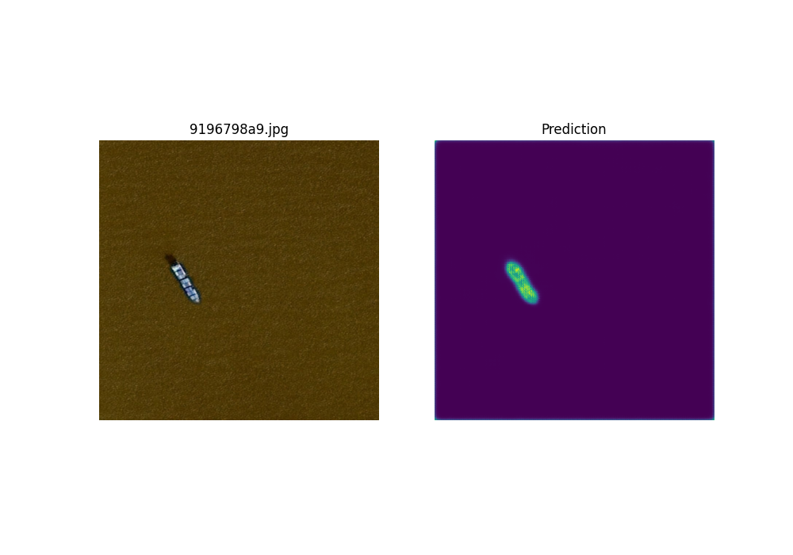
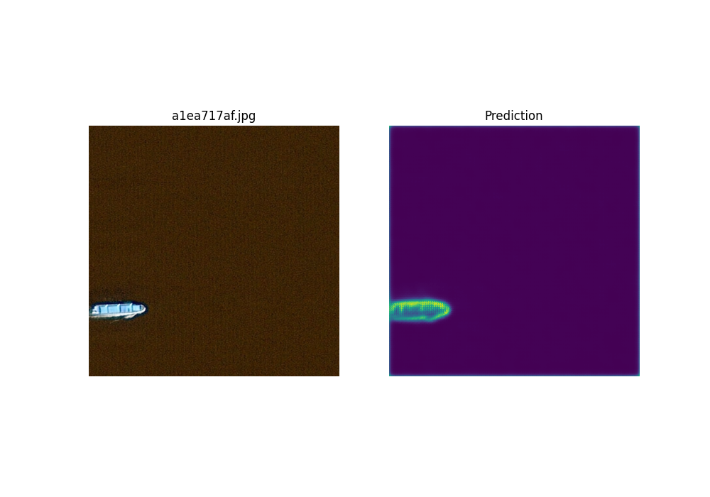
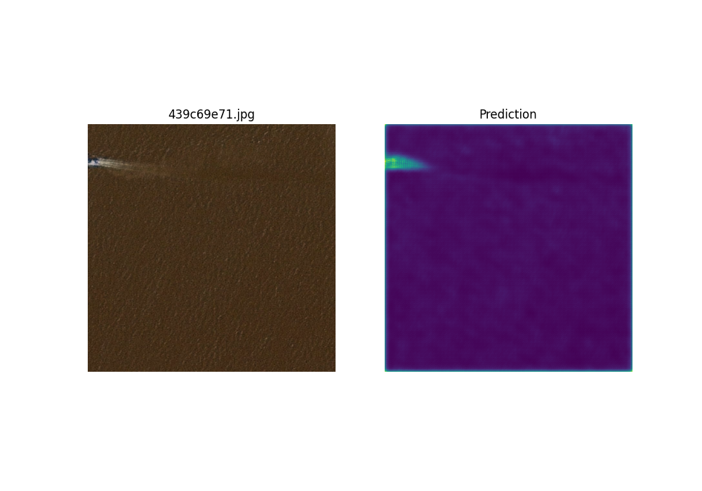
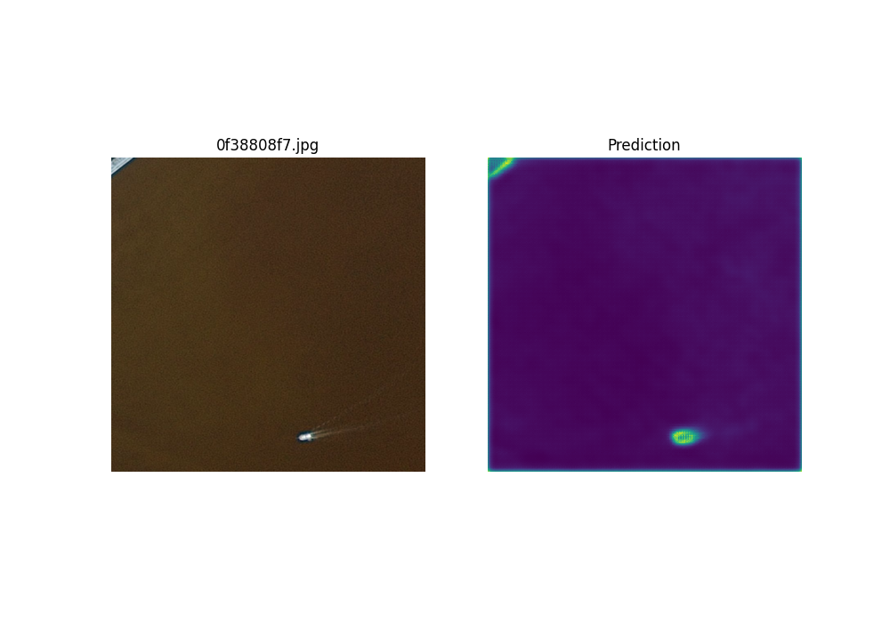
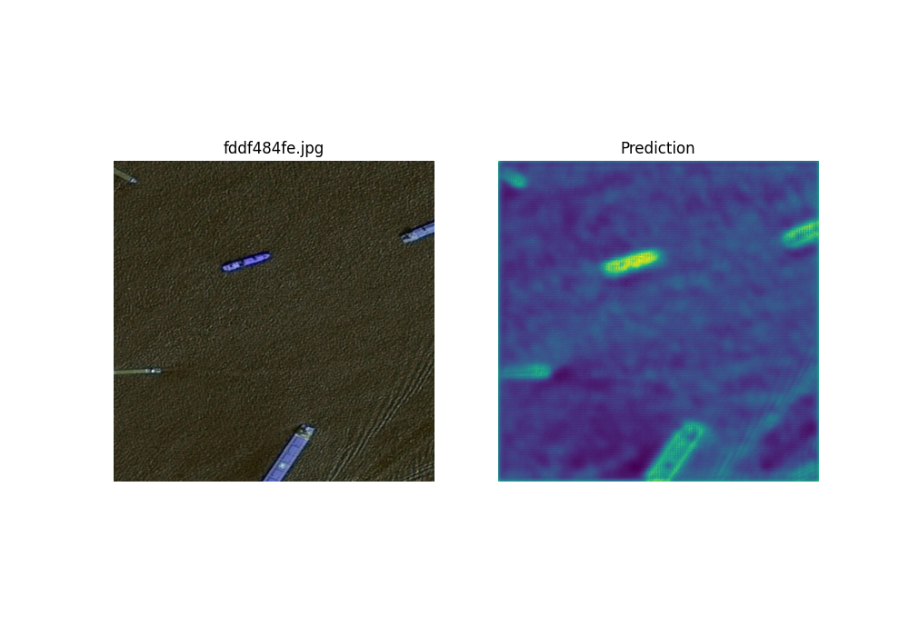

# Airbus Ship Detection

## Author: [Dmytro Khamula](https://github.com/hamuladm)

## Installation
```
git clone https://github.com/hamuladm/Airbus-Ship-Detection
```

## Dependencies
```
pip install -r requirements.txt
```

## Abstract
<mark>My goal of the project was to implement and train the model as simple as possible. The aim of competition was to detect ships on images received from setelite. There were the whole set problems, such as imbalanced dataset, incorrectly encoded masks, etc. I did my best and hope the implementation will be useful for guys that are interest in ML & CV.</mark>

## EDA
### Balancing the dataset
<mark>The dataset contained >90% images without ships. I decided to balance the data in simple and elegant way. For each group (number of ships) I set upper bound 4000 images. Pandas library gives powerful interactions with .csv files. As result, balancing dataset took < 19 lines of code. </mark>

### Constructing the model
<mark>I used tf.keras for building CNN. U-Net architecture was chosen for the task as it deals perfectly with objects segmentation. For RAM efficiency downscaled images from 768x768 to 256x256.</mark>

### Callbacks, optimizers, etc.
<mark>After reading some forums I decided to choose ModelCheckpoint, ReduceLROnPlateu, and Early stopping. Adam was chosen for optimizer.

</mark>

## Project structure
```
├── config.py
├── eda.ipynb
├── metrics.py
├── models
│   └── model.h5
├── README.md
├── requirements.txt
├── test.py
├── train.py
├── utils.py
└── weights
    └── seg_model.weights.h5
```
<mark>EDA of the dataset is stored in ```eda.ipynb``` file. Training the model is implemented in ```train.py```. Testing the model - ```test.py```. Other files are utility functions for training the model, such as generating data batches, constants, etc.</mark>

## Results
### Metrics
| Optimizer  | GPUs  | Measurement     | Score  |
| ---------  | ----  | --------------- | ------ |
| Adam       | 2x P4 | dice_coef       | 0.0462 |
| Adam       | 2x P4 | binary_accuracy | 0.9901 |
| Adam       | 2x P4 | loss            | 0.0105 |

### Predictions






